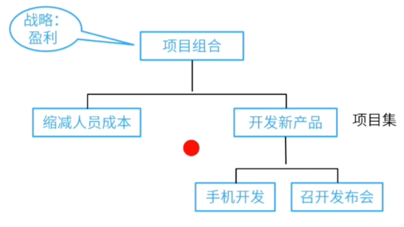
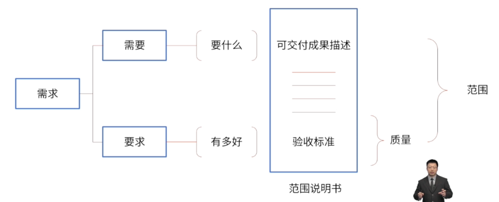
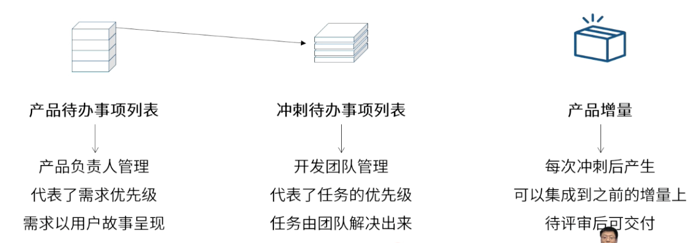

icon:: 󱍋

- ### [[项目组合]]与[[项目集]]
	- ||关注点|作用|
	  |--|--|--|
	  |项目集|以正确的方式做事|调整依赖关系|
	  |项目组合|做正确的事|调整项目优先级|
	- 
	- #Question
	  collapsed:: true
		- #card 某家公司有一些项目，即项目A，B，C。这些项目是根据公司的目标，按照一套相同的标准划分优先顺序。项目B的优先级较高，因为它将会扩大公司的市场份额， 减少对不可靠供应商的依赖性。这是在执行什么活动？ {{cloze B}} 
		  A.获得市场份额
		  B.项目组合管理
		  C. 项目启动
		  D. 项目集管理
- ### [[范围]]和[[质量]]
	- 范围包含质量
	- 
	- #Question
	  collapsed:: true
		- #card 一家工程咨询公司的设计师已完成设计开发并发布设计用于生产，在核实可交付成果过程中发现设计标准发生了变化，已生产的可交付成果不符合新标准。若要避免这个问题，项目经理应该事先实施哪个规划过程？ {{cloze C}} 
		  A.项目整合管理
		  B.控制质量
		  C.规划范围管理
		  D.规划质量管理
		- #card 客户抱怨说产品要求的标准未满足。项目经理确定已正确记录客户要求的标准，且保持不变。项目经理应该怎么做？ {{cloze C}} 
		  A.查看范围管理计划
		  B.开展假设情景分析，确定潜在变更的影响
		  C.查看质量管理计划
		  D.提交变更请求解决该问题
- ### [[产品待办事项列表]]、[[冲刺待办事项列表]]和[[产品增量]]
	- 
- ### [[沟通管理]]与[[干系人管理]]
	- 沟通管理的本质是项目信息的正确传递。干系人管理的本质是让干系人支持项目。
	- 沟通管理的本质是项目信息的正确传递。什么是信息？就是在项目运行过程中产生子种数据、信息、报告、状态等。这些信息需要以正确的方式在正确的时间传递给正确的人。
	- 干系人管理的本质是让干系人支持项目。涉及管理干系人对项目的支持与抵制。让干系人支持项目并对项目感到满意是项目管理的终极目标。
	- > 沟通就是与干系人进行沟通。
	  管理干系人的参与就是通过沟通的方式来进行管理的。
- ### [[审计]]与[[审查]]
	- 审计与审查的核心区别是前者针对过程，后者针对结果。
	- **若要判断一个项目完全成功，需要确保两点：过程合规、结果合格。**只有同时满足过程合规结果合格的情况下，项目才是完全成功的。
	- 为了更清晰地说明上述观点，还是举例说明。审计与审查分别在质量、风险与采购三个知识领域出现。
		- 以采购为例，成功采购了一台设备，从结果上来看设备运行 OK，但是从过程来看，发现这个过程中出现了受贿的腐败问题，那么就不能认为整个项目是成功的。
		- 以质量为例，测试完发现所有的产品测试合格，但是从过程来看，产品测试合格的原因是因为设备故障，如果设备未故障，测试就是不合格的，那么就不能认为质量工作是成功的。
		- 以风险为例，一个风险发生了，成功应对，但是从过程来看，应对的过程中采取了不安全的措施，例如“未戴防毒面具处理废气泄露问题”，那么就不能认为风险应对是成功的。
		- 以上三个案例中，**对结果的检查，叫审查；而对过程的检查叫审计**。
	- 因此，审查与审计的区别，可以用以下两句话来区分：
		- > 审查是在过程中对结果进行审查。
		  审计是在有结果后对过程进行审计。
- ### [[定性风险分析]]与[[定量风险分析]]
	- > 定性分析关注意义，判断趋势
	  定量分析关注频率，决定细节
	- 定性风险分析
		- ((6845321f-1f77-41d1-80b1-10dc83370b26))
	- 定量风险分析
		- ((684579cc-0b8e-4a26-966f-a4c318692f0b))
	- 这两种分析方法各有优缺点，定性分析适合处理主观性较强的场景，而定量分析则提供更为准确的风险评估数据。
- ### 提前量和滞后量
  id:: 68457264-a49b-4d83-ab4c-8f6937335f26
	- 提前量是相对于紧前活动，紧后活动可以提前的时间量。
	- 滞后量是相对于紧前活动，紧后活动需要推迟的时间量。
	- 提前量的意思就是后一个活动可以提前开始。
	- > 如， 可以在大楼收尾施工前进行绿化施工。
	- 滞后量与之相反。
	- > 如，刷完腻子后，必须等2天才能刷乳胶漆。
	- 
-