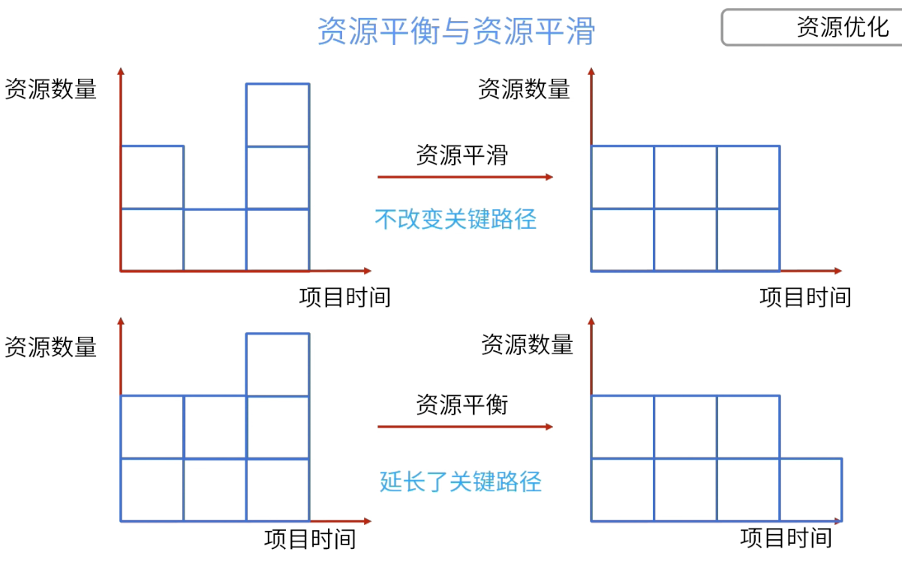

- 资源优化技术是根据资源供需情况，来调整进度模型的技术。
- > 资源优化解决的是资源被**过度分配**，或者安排不合理的问题。比如会出现某一周所有人加班，某一周人们工作量相对较少的情况。需要用资源优化技术**削峰填谷**。
- 
- ## 资源平衡
	- 为了在资源需求和供给之间取得平衡， 根据资源制约因素对开始和完成日期进行调整的技术。适用于**资源被过度分配**的情况。
- ## 资源平滑
	- 对进度模型中的活动进行调整，从而使项目资源需求不走出限制的一种技术。资源平滑不改变关键路径，但是可能无法实现所有资源的优化。
- 项目经理资源有限，无法获得更多资源。项目经理应该使用什么技术来充分利用现有资源，而不会令项目完成时间延期？ {{cloze C}} #card
	- A.[[快速跟进]]
	- B.[[赶工]]
	- C.[[资源平滑]]
	- D.[[资源平衡]]
-