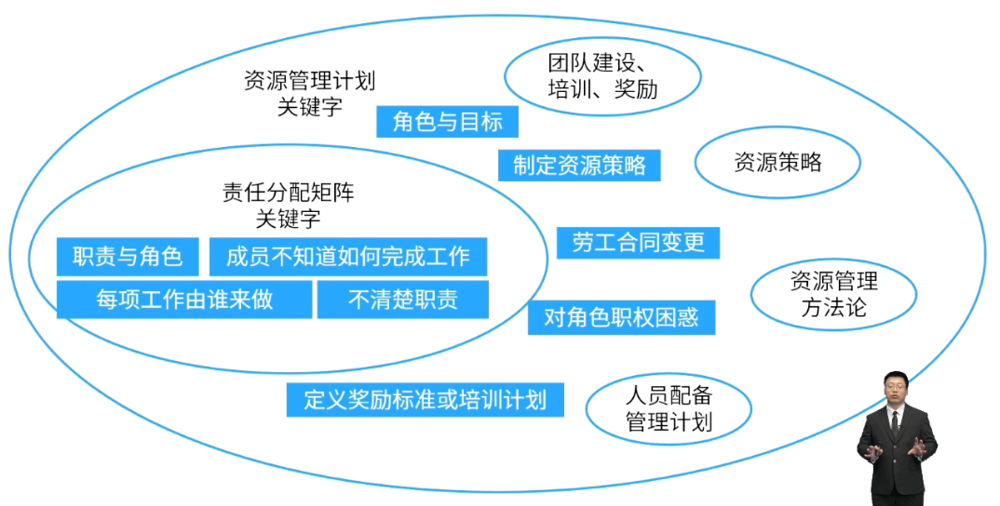

- #重点
- 资源管理计划提供了关于如何分类、分配、管理和释放项目资源的指南。
- > 资源管理计划是针对项目资源的整体性指南。也包括角色与职责的内容。
  因此，当成员不清楚自己的角色与职责时，可以找资源管理计划。
- 
- **资源管理计划包括的内容：**
	- 识别资源方法
	- 获取资源的指南
	- 角色与职责
	- 项目组织图
	- 项目团队资源管理，什么时候定义、管理和遣散。
	- 团队建设的方法
	- 资源控制的方法
	- 认可计划，即哪些成员给予奖品以及如何给予。
- #Question
	- #card 在一个软件开发项目的执行阶段，一些海外开发成员**加入团队**，项目经理应首先更新哪一项内容？
	   A：范围管理计划
	   B：沟通管理计划
	   C：项目进度计划
	   D：资源管理计划
		- 正确答案：D 
		  解析：海外成员加入，属于团队成员的更新，需要更新资源管理计划。