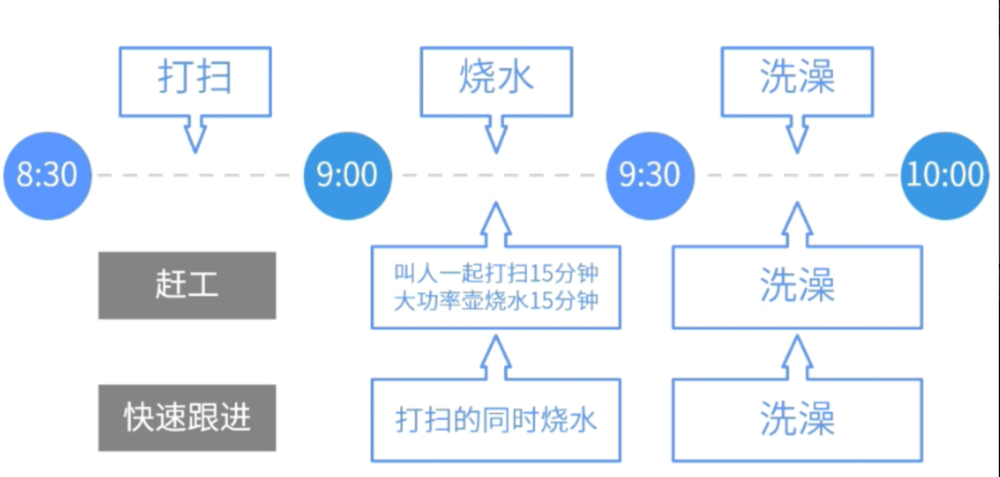

- 进度压缩技术是指在不缩减项目范围的前提下， 缩短或加快进度工期，以满足进度制约因素、强制日期或其他进度目标。
- > 进度压缩指得是压缩工期，有两种方式，赶工需要加钱，快速跟进不需要加钱。
-
- 
- 赶工要增加成本；快速跟进改变进度网络，一般不增加成本，但是因为任务并行，风险会增加。当[[CPI]]>1，[[SPI]]<1时，最好的方式是赶工
	- ## 赶工
		- 通过增加资源，以最小的成本代价来压缩进度工期的一种技术。如，加班或增加资源，或支付加急费用等。
	- ## 快速跟进
		- 将正常情况下按顺序进行的活动或阶段改为至少是**部分并行开展**。这种一般会增加风险。
		- > 如图纸还未全部完成就开始建地基。
- #Question
  collapsed:: true
	- #card 项目经理管理的项目的进度绩效指数（SPI）为0.9，成本绩效指数（CPI） 为1.3。当前关键活动的总行动时间为-4天，任务关系都是完成到开始（FS）。若要将项目拉回正轨，项目经理应该做什么？ {{cloze B}}
	  A.使用[[快速跟进技术]]
	  B. 应用[[赶工技术]]
	  C. 减少[[项目范围]]
	  D. 修订[[项目进度计划]]
	- #card 项目发起人通知项目经理，最关键的项目标准是按时交付产品，客户对资源可用性没有时间限制，哪个行动会减少时间表，但会增加风险？ {{cloze B}}
	  A. 添加团队成员
	  B.并行执行活动
	  C.外包项目执行
	  D.聘请高薪专家
	- #card 在项目评审会上，从事活动AD的项目团队成员通知项目经理，完成该活动还需要三天，组织的高级经理要求项目经理，即使需要额外的预算，也必须找到方法，按原定基准计划交付项目。项目经理应该使用什么方法来满足高级经理的需求？
	  id:: 6840785e-88cf-496a-8218-d09621fa4b3a
	  collapsed:: true
	   A：使用[[快速跟进]]
	   B：使用[[赶工]]
	   C：应用[[关键链法]]
	   D：应用[[时间提前量]]和[[时间滞后量]]
		- 正确答案：B
		  解析：增加额外的预算赶工到原基准，属于典型的赶工。
	- #card 项目经理资源有限，无法获得更多资源。项目经理应该使用什么技术来充分利用现有资源，而不会令项目完成时间延期？
	  id:: 684078ed-7c37-441d-a51e-b53953c2bf36
	   A：[[快速跟进]]
	   B：[[赶工]]
	   C：[[资源平滑]]
	   D：[[资源平衡]]
		- 正确答案：C 
		  题干提到要充分利用资源，还不能延期，因此选择资源平滑而非平衡。注意，不选择快速跟进的原因是因为要解决的是资源问题，而非进度问题。
	- #card 一个项目经理被分配到一个针对客户的分析项目。项目经理需要确保团队的表现始终领先于预计的交付进度。项目经理在推动项目未来的冲刺周期上应该采取哪些措施？A project manager is assigned to an analysis project for a customer. The project manager needs to keep the performance of the team a step ahead of the estimated delivery schedules. What should the project manager do to impact the sprint cycles going forward on the project?
	  A：增强团队的能力，以改善冲刺周期，并提供每周趋势报告。Build the capacity of the team to improve sprint cycles and provide weekly trend reports.
	  B：聘请项目管理专家向团队解释在冲刺周期中工作的速度。Engage an expert in project management to explain to the team how fast to work on the sprint cycle.
	  C：与团队合作，只专注于预先沟通的项目结果。Work with the team on how to focus on only pre-communicated project results.
	  D：培训团队在时间表内分析数据并完成用户故事。Train the team to analyze data and complete the user stories within the schedule.
		- 正确答案：A
		  解析：根据题干描述，目前团队需要“比预计的交付进度提前一步”，也就是要压缩当前的进度。因此只有A提到的增强团队能力，并持续监控，才能有机会在冲刺周期内交付更多的用户故事（提高速度），最终实现进度压缩并提前交付。 选项B，目前是需要压缩进度，并不是团队不理解速度的概念。选项C，目前是需要压缩进度，并不是要变更项目结果。选项D，目前是需要压缩进度，不能再遵循原有的时间表。