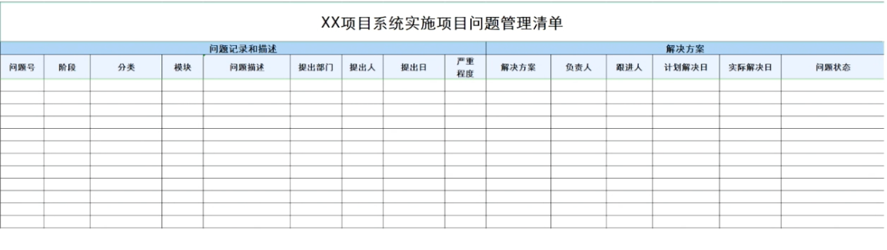

alias:: Issue Log,问题列表

- 
- # 定义
	- 记录和监督问题信息的项目文件。
- # 解析
	- 问题日志可以帮助项目经理有效跟进和管理问题， 确保它们得到调查和解决。
	- 应该在整个项目生命周期内更新问题日志。
- > 在PMBOK®指南中的各种不断更新的项目文件包括：
  •[[问题日志]]，用于记录和跟踪问题。
  • [[变更日志]]，用于记录变更的状态。
  • [[经验教训登记册]]，用于记录经验教训。
  • [[风险登记册]]，用于记录风险的内容。
  • [[干系人登记册]]，用于记录干系人的基本信息。
- #Question
	- #card 项目经理注意到正在构建的系统存在多个质量问题，项目经理应该使用什么来跟踪这些问题的解决方案？
	  A：变更控制过程
	  B：质量分析
	  C：风险审查
	  D：问题日志
		- 正确答案：D
		  解析：问题日志主要用于记录和跟进项目中的问题