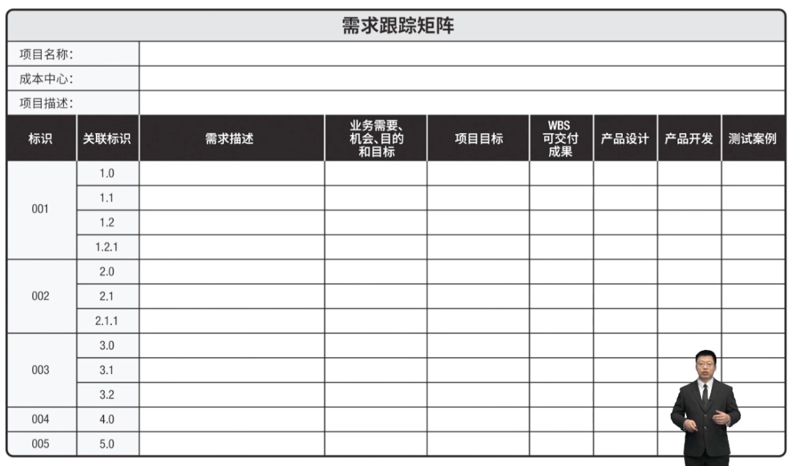
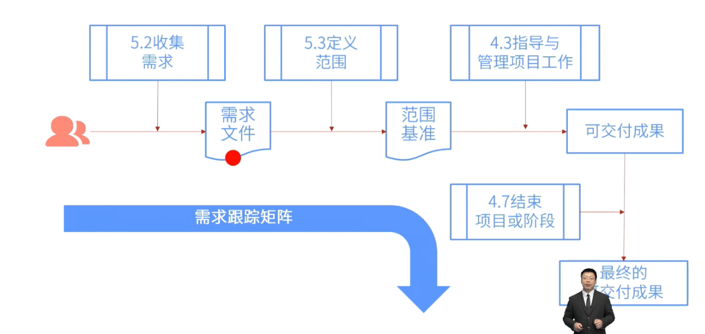

- #重点
- 需求跟踪矩阵是把产品需求从其来源连接到能满足需求的可交付成果的一种表格。
- > 需求跟踪矩阵能够跟踪需求的全生命周期。
- 
- # 地位
	- 需求跟踪矩阵在[[收集需求]]阶段的地位
		- 
- # 功能
	- ## 连接、联系 - 可交付成果物、项目目标
		- 使用需求跟踪矩阵，把每个[[需求]]与[[业务目标]]或[[项目目标]]联系起来，有助于确保每个需求都具有[[商业价值]]。
	- ## 跟踪 - 需求情况
		- 需求跟踪矩阵提供了在整个[[项目生命周期]]中跟踪需求的一种方法，有助于确保需求文件中被批准的每项需求在项目结束的时候都能交付。
	- ## 变更 - 项目范围
		- 需求跟踪矩阵还为管理[[产品范围变更]]提供了框架。
	-