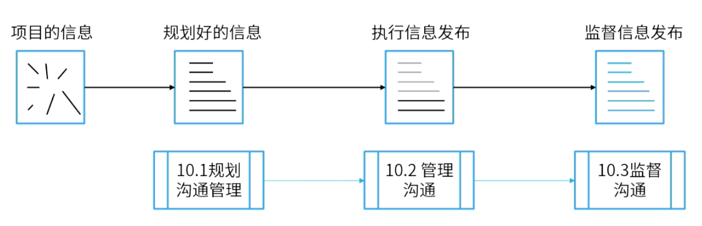

alias:: 沟通

- 项目沟通管理包括通过开发工件，以及执行用于有效**交换信息**的各种活动，来确保项目及其干系人的**信息需求**得以满足的各个过程。
- > 沟通的本质是项目信息的正确传递。
- **在项目管理实践中，项目经理大部分精力都在沟通**
- > 如：开会、写报告、做演讲、汇报进度等。
- 干系人越多，沟通越复杂，如有N个干系人， 则沟通渠道有N*（N-1）/2个。
- **沟通活动的分类**
	- 内部与外部：内部团队与外部干系人沟通。
	- 正式与非正式
	- 向上、向下、横向沟通
	- 书面与口头沟通
- # 过程组
	- 
	- ## 规划
		- [[规划沟通管理]]
	- ## 执行
		- [[管理沟通]]
	- ## 监控
		- [[监督沟通]]
- #Question
	- #card 在项目执行过程中，项目经理被告知，大多数项目团队成员已经加入了新实施的在家工作的公司计划。项目经理应该如何在项目中反映这一变化？
	  A：更新干系人参与计划，包括已加入的团队成员的紧急联系信息
	  B：在资源管理计划中更新已注册的团队成员的资源日历
	  C：在沟通管理计划中为注册的团队成员更新沟通方式
	  D：更新责任分配表(RAM)中登记的团队成员的角色和责任
		- 正确答案：C
		  解析：(见到)[[虚拟团队]]找沟通。