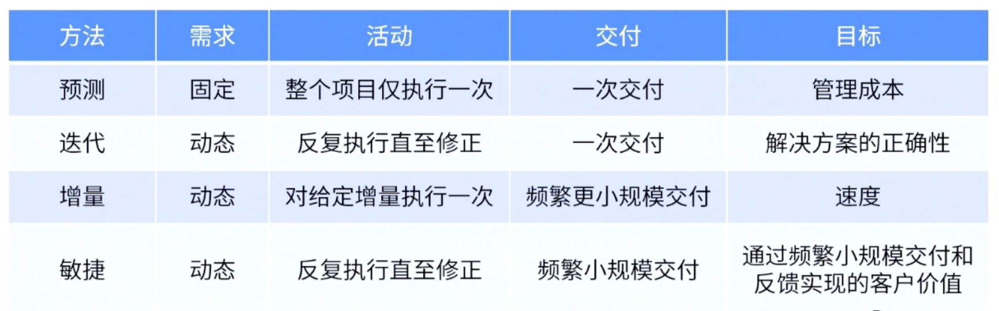

- 项目生命周期是从技术角度将一个项目分成了多个阶段。每个阶段都有单独的项目管理过程，其中每个阶段完成后至下一阶段开始前的时间点叫做[[阶段关口]]
- ## 项目生命周期的特点
	- 项目在生命周期的早期，风险最高，变更成本最低。而在项目生命周期的后期，风险最低，变更成本最高。
	- 
- ## 项目生命周期类型
	-  #重点
	- ### [[预测型生命周期]]
	- ### [[迭代型生命周期]]
	- ### [[增量型生命周期]]
	- ### [[适应型生命周期]]
	- ### [[混合型生命周期]]
	- #Question
	  collapsed:: true
		- #card 政府已与一家供应商签订合同，为即将到来的选举开发一款计算选票的软件应用程序，需求得到了很好的定义，这样项目就可以按照传统方式进行管理。然而，由于过去类似应用程序的失败，政府希望供应商能够对可交付内容的适用性进行快速反馈。供应商的项目经理选择什么样的进度计划方法最好？
		  A：预测式
		  B：传统式
		  C：高效式
		  D：敏捷式
			- 正确答案：D
			  解析：需要快速反馈，因此选择敏捷型。
	-
	-
-