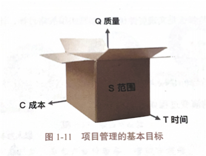
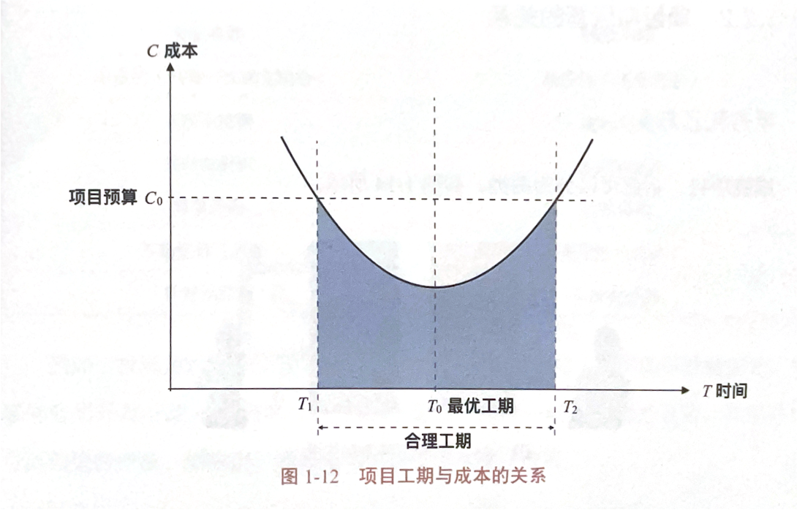
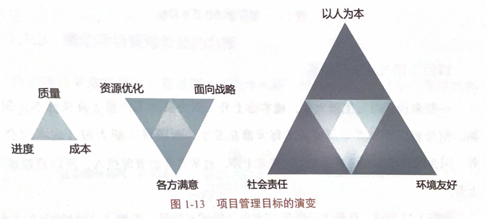
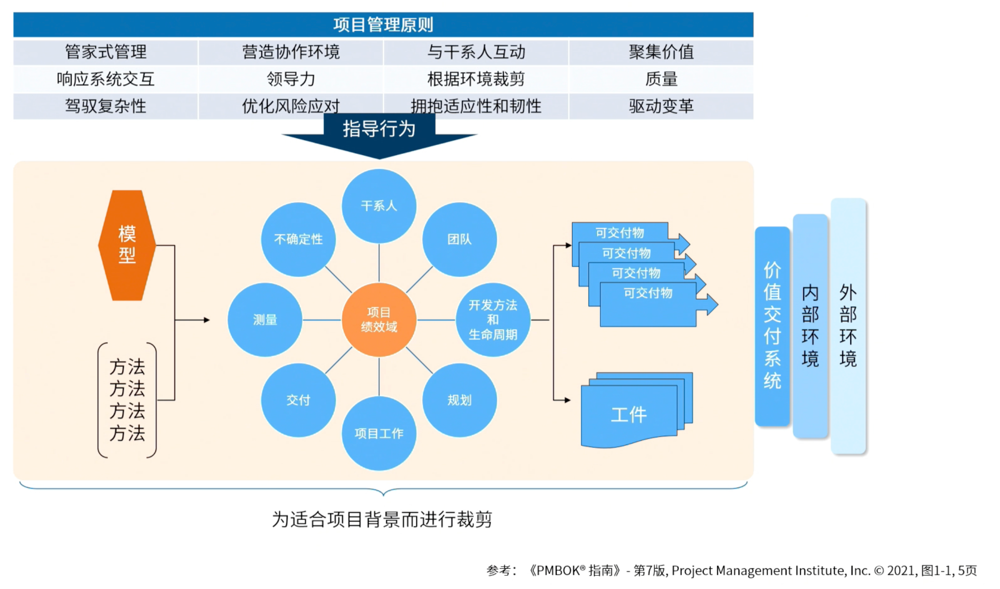
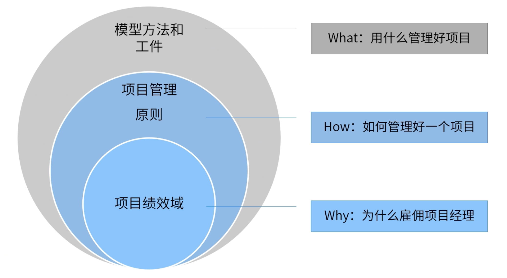

- > 在规定的**时间**内，在批准的**预算**内，**完成**事先的工作范围内的工作，并使项目**达成预期质量和性能要求**
- > 项目管理是指将知识、工具与技术应用于项目活动以满足项目的需求。
- ## 基本目标
  id:: 664820a8-5b3c-4f45-97e4-40dd66204947
	- 
	- 项目管理的基本目标是在**规定的时间内（时间**），在**批准的预算（成本）**内完成事先确定的工作范围内的工作，并使项目达到**预期的质量和性能要求（质量）**。
	- > 一般来说，项目工期太长，成本会上升，因为虽然工作量**（直接成本）**没增加，但房租、管理费用等**间接成本**每天都在发生。而项目工期太短成本也会上升，因为如果团队在更短的时间内完成工作，通常要增加资源投入，所以直接成本上升，
	  在最优工期T完成项目的成本最低，T1到T2的时间段是合理的工期，只要在这段时间内完成项目成本就不会突破预算。
	  {:height 345, :width 580}
- ## 阶段性目标
	- ### 初级阶段
		- 同[基本目标](logseq://graph/PMP?block-id=664820a8-5b3c-4f45-97e4-40dd66204947)
	- ### 进阶阶段
		- 实现**资源优化**、实现组织战略目标**（面向战略）**、让项目干系人满意**（各方满意）**
	- ### 高级阶段
		- **以人为本**、实现**社会责任**和**环境友好**
	- 
- ## 项目管理的作用
	- ### 项目使战略落地
		- 项目能够使企业战略落地的原因如下：
			- 项目是企业战略落地的单元；
			- 项目是企业利润的来源；
			- 项目是企业跨部门协作的载体。
	- ### 项目管理创造商业价值
		- 项目管理可以让美妙的想法变成产品，使客户的需求得到满足。
	- ### 项目管理驱动变革
		- 组织需要不断变革自己的组织架构、管理模式个流程制度，去适应外部环境的变化与内部创新的需要。变革本身也是项目，项目管理可以去驱动组织向着正确的方向变革。
		- 很多企业向谷歌和领英学习，通过变革项目实现从[[关键绩效指标]]（KPI）到[[目标与关键成果法]]（OKR）的转变。
		  也有不少企业像阿里巴巴一样，通过变革项目，实现了数据中台、业务中台等能力整合。
- ## 项目管理的发展
	- ### 古代项目管理
		- #### 埃及金字塔
		- #### 万里长城
	- ### 近代项目管理
		- ### 曼哈顿计划
		- ### 阿波罗登月
	- ### 现代项目管理
- ## 项目管理原则
	- 
	- 