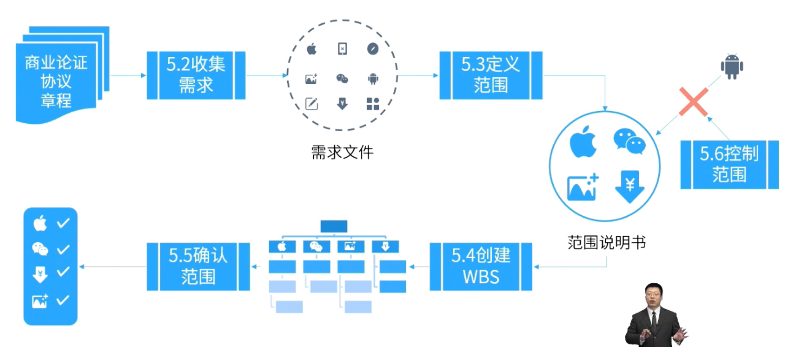

alias:: 范围,项目范围

- **定义：**项目所提供的产品、服务和成果的总和。
	- > 产品范围：产品的功能。
	  项目范围：为交付产品功能必须完成的工作。
- 范围是规划一个项目的开始，只有知道要做什么，做到什么程度，才能继续进行进度、成本、 风险等后续的一系列的规划。
- > **范围基准**
  预测型项目中的范围基准是由：
  范围说明书、WBS、WBS词典组成。
  变更范围必须要走变更流程。
- > **产品待办事项列表**
  由用户故事组成的产品需求列表， 由产品负责人进行优先级的梳理与管理。
- > **范围来源于[[需求]]**
  需求是指根据特定协议或其他强制性规范，产品、服务或成果必须具备的条件或能力。
- # 过程组
	- 
	- ## 规划
		- [[规划范围管理]]
		- [[收集需求]]
		- [[定义范围]]
		- [[创建WBS]]
	- ## 监控
		- [[确认范围]]
		- [[控制范围]]