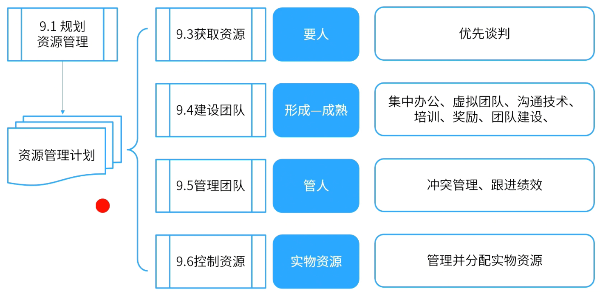

alias:: 资源

- # 过程组
	- 
	- ## 规划
		- [[规划资源管理]]
		- [[估算活动资源]]
	- ## 执行
		- [[获取资源]]
		- [[建设团队]]
		- [[管理团队]]
	- ## 监控
		- [[控制资源]]
- #Question
	- #card 项目团队成员来自多个部门，并将处理项目和运营活动，任务和资源均已确定。若要确保资源，项目经理应做什么？
	  Project team members come from multiple departments and will handle project and operational activities, tasks and resources have been determined. What should the project manager do to ensure resources?
	  A：要求职能经理为项目提供可用资源 Ask the functional manager to provide available resources for the project
	  B：与职能经理协商项目的资源和角色 Negotiate project resources and roles with functional managers
	  C：联系资源，沟通任务，并与职能经理确认 Contact resources, communicate tasks, and confirm with functional manager
	  D：将资源需求发送给发起人以与职能经理协商 Send resource requirements to the sponsor to negotiate with the functional manager
		- 正确答案：B
		  解析：过程组：实践指南 页码：P284 谈判：职能经理。确保项目在要求的时限内获得最佳资源，直到完成职责。 执行组织中的其他项目管理团队。合理分配稀缺 或特殊资源。 外部组织和供应商。提供合适的、稀缺的、特殊的、合格的、经认证的或其他 特殊的团队或实物资源。特别需要注意与外部谈判有关的政策、惯例、流程、指南、法律及其他标准。 获取资源，优先谈判。