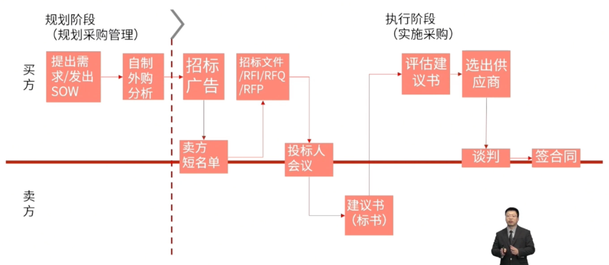

alias:: 采购

- 项目采购管理包括从项目团队外部采购或获取所需产品、服务或成果的各个过程。
- > 注意角色转换，在采购知识领域，项目经理由乙方转换为甲方。
- 注意事项：
	- 项目经理无权签署法律协议。
	  logseq.order-list-type:: number
	- 采购合同具备法律效应。
	  logseq.order-list-type:: number
	- 采购部门有权代表组织签署和管理合同。
	  logseq.order-list-type:: number
	- 合同一般需要经过法务部审批。
	  logseq.order-list-type:: number
	- 卖方首先是投标人、然后是中标人、之后是签约供应商。
	  logseq.order-list-type:: number
- 
- # 过程组
	- ## 规划
		- [[规划采购管理]]
	- ## 执行
		- [[实施采购]]
	- ## 监控
		- [[控制采购]]
- #Question
	- #card 一个从事大规模网络实施的项目经理对硬件供应商感到沮丧。他们的交货一直很晚，而且经常没有关键部件。项目经理的公司已经决定取消合同，转向新的供应商，但唯一的选择是海外公司。项目经理应该首先做什么来进行这个变更？A project manager working on a large-scale network implementation is frustrated with the hardware supplier. Their deliveries have been consistently late and frequently do not have vital components. The project manager's company has decided to cancel the contract and move to a new supplier, but the only other option is an overseas company. What should the project manager do first to proceed with this change?
	  A.请求采购部门的帮助，了解下一步该怎么做。Request assistance from the procurement department on the next steps.
	  B.雇用一个懂得项目领域的翻译师。Engage the services of an interpreter who understands the project domain.
	  C.检查社交媒体，确定是否有使用新供应商的共同联系人。Check social media to determine if there are shared contacts using the new supplier.
	  D.了解新供应商的任何文化特点，这可能会影响谈判。Understand any cultural characteristics of the new supplier, which may affect negotiations.
		- 正确答案： A
		  解析：
		  项目遇到问题时，首先要分析问题，A选项请求采购部门帮助，了解下一步该怎么做，有分析问题的含义，而D选项则可能是分析问题后采取的措施，所以选A。