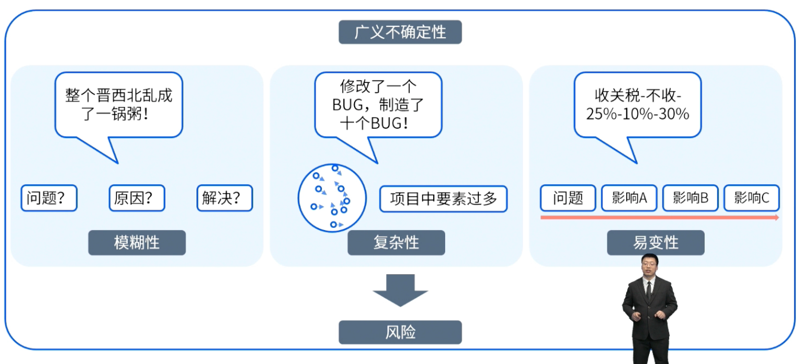

- 一旦发生，会对一个或多个项目目标产生正面或负面影响的不确定事件或条件。
- > 可以从定义中识别出风险的一系列要素。其中最重要的三要素是：事件、影响、概率。
	- 一旦发生：说明当前还没有发生，**将来可能发生**。
	- 对项目目标产生**影响**：风险发生会影响项目目标，即影响进度、成本、质量等。
	- 正面或负面：风险是中性词，正面风险是**机会**，负面风险是**威胁**。
	- 不确定：风险的发生存在**概率**。
	- 事件或条件：风险是一个**事件**。
- 
- # 概念 #重点
	- [[应急计划]]
	- [[弹回计划]]
	- [[权变措施]]
	- [[风险再评估]]
	- [[次生风险]]
	- [[残余风险]]
- #Question
	- #card 项目经理领导的创新项目由于高度的不确定性而面临很多风险。项目经理应该使用什么策略来使用敏捷方法来管理这些风险？ {{cloze D}}
	  A.开发敏捷风险矩阵来跟踪、评估和评估项目的不确定性
	  B.实施scrum风险回顾会议，在项目结束时分析风险
	  C.指派一个敏捷风险经理来更好地理解和跟踪项目风险
	  D.不断评估风险，并随着项目进展重新确定工作的优先次序