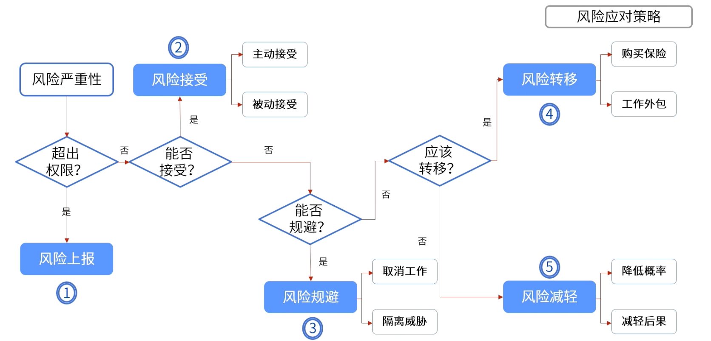
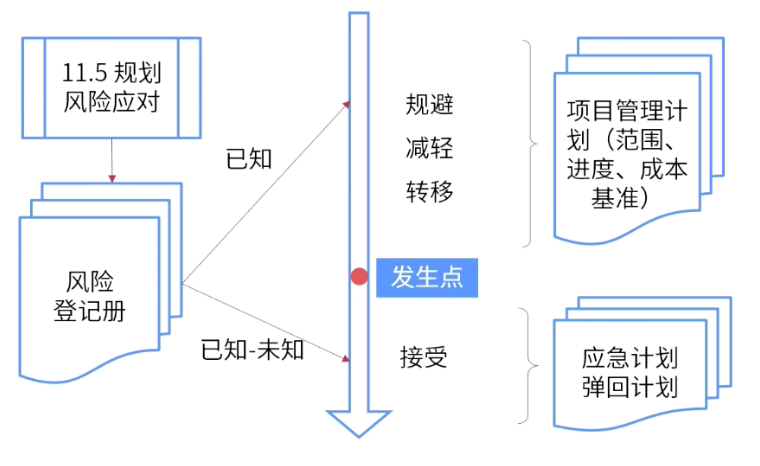
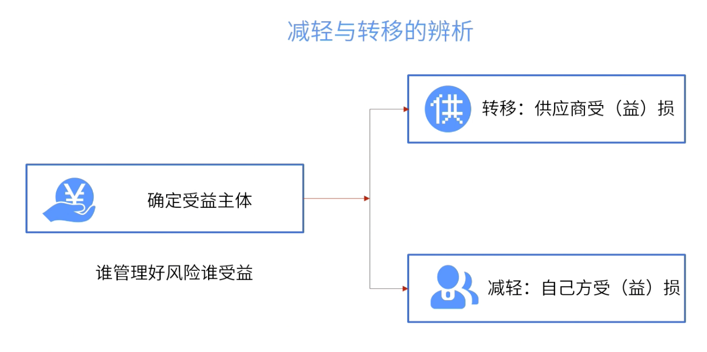
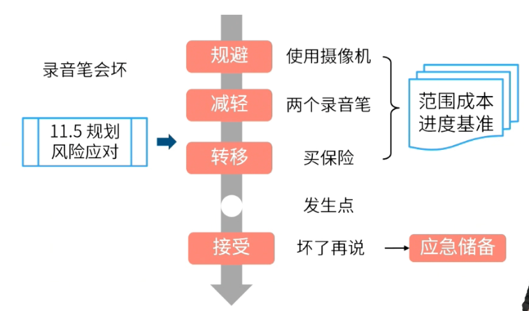

alias:: 风险应对计划

- #重点
-
- {:height 266, :width 536}
- | **[[威胁应对]]** #重点 | **[[机会应对]]** | **[[应急应对]]**     | **[[整体应对]]**  |
  | -------- | -------- | ------------ | --------- |
  | 上报     | 上报     | 风险触发采取 | 规避/开拓 |
  | 规避     | 开拓     | 应急         | 减轻/提高 |
  | 减轻     | 提高     |              | 转移/分享 |
  | 转移     | 分享     |              | 接受      |
  | 接受     | 接受     |              |           |
- [[应急应对策略]]是指在[[规划风险应对]]时，要确认风险的触发事件。不用等到风险实际发生，一旦触发事件发生，就需要采取应对措施。
	- > 例如：当系统识别到王某与烈性传染病确诊患者有共同的时空接触，则不需要等到王某确诊，相关人员就要对王某采取相应的措施。
- | | 作用要素 | 关键字 | 举例 |
  | ---- | ---- | ---- |
  | 上报 | 超出权限 | 超出权限、范围 | 跨项目，项目集、项目组合层面解决 |
  | 规避 | 消除事件 | 消除威胁，严重影响 | 消除威胁原因、延长进度计划、改变项目策略、缩小范围、澄清需求、获取信息、改善沟通、专有技能 |
  | 转移 | 费用分担、财务风险 | 保险、担保、外包 | 购买保险、使用履约保函、保证书、担保书、外包 |
  | 减轻 | 减少概率或影响 | 多次测试、增加资源、降低影响、减少概率 | 采用较简单的流程，进行更多次的测试，选用更可靠的卖方，原型开发，加入冗余部件 |
  | 开拓 | 确保肯定出现 | 确保、100% | 分配最有能力的资源、使用全新技术 |
  | 分享 | 收益分担 | 合资 | 建立合伙关系、合作团队、特殊公司、合资企业 |
  | 提高 | 增加概率或影响 | 提高概率或影响 | 为早日完成活动而增加资源 |
  | 接受 | 应急储备 | 接受、不再处理 | 建立应急储备、定期审查不采取行动 |
  #混淆点
- #Question
	- #card 某项目出现跨项目资源使用问题及高层面临变更风险，项目经理应该采用哪种风险应对方法？  {{cloze B}}
	  A.减轻
	  B.上报
	  C.规避
	  D.转移
	- #card 可以使用什么策略来应对消极风险或威胁以及积极风险或机会？
	  collapsed:: true
	  A：接受
	  B：减轻
	  C：规避
	  D：开拓
		- 正确答案：A
		- 解析：接受是威胁以及机会共同使用的策略。
- ## 规避与减轻
	- > 风险影响三要素
	- 事件 ：对**事件**进行处理被视为**规避**风险
	- 概率：减小风险**概率**可以**减轻**风险
	- 影响：对**影响**做出处理以**减轻**风险
- ## 减轻与接受
	- 
	- > 在风险发生之前不采取措施， 不更改项目管理计划。
	- #Question
	  collapsed:: true
		- #card 在某建设工程项目的地基开挖过程中，对于因气候原因造成的进度拖后风险，项目经理**采取了风险接受的策略**。由于在施工期间下特大雨，工程不得不停工3天。项目经理应该怎么做？
		  id:: 684076f9-9af1-4e6a-81fe-239a5d9daab8
		  collapsed:: true
		   A：使用应急储备
		   B：把项目工期延长3天
		   C：要求保险公司赔偿
		   D：与团队成员开会讨论处理方案
			- 正确答案：A
			  解析：项目经理采取了风险接受的策略，说明已经储备了一些进度，因此使用应急储备即可。而B属于规避、C属于转移、D属于减轻或权变措施。
- ## 减轻与转移
- 
- 
- #Question
	- #card 一位项目经理刚刚为一个价值387000美元的工程项目制订了风险应对计划。他下一步很可能怎么做？
	  A：确定项目总体的风险级别
	  B：开始分析项目图纸上出现的问题
	  C：在项目的[[工作分解结构]]中增加[[工作包]]
	  D：重估项目风险
		- 正确答案：C
		  解析：在制订风险应对计划后，一般要变更项目管理计划，因此选择C，增加项目范围中的内容。
	- #card 项目发起人通知项目经理：一项新的法律被批准了。该法律将影响项目的进度计划和预算，这种可能性作为一种需要**主动接受的风险**（威胁）被包含在风险管理计划中。项目经理下一步应该做什么？
	  A：更新风险管理计划，并记录经验教训
	  B：向变更控制委员会(CCB)提交一份变更请求
	  C：使用应急储备来应对这种情况
	  D：评估管理储备以控制该风险
		- 正确答案：C
		  解析：题干明确了需要主动接受风险，因此选择使用应急储备来应对这种情况。